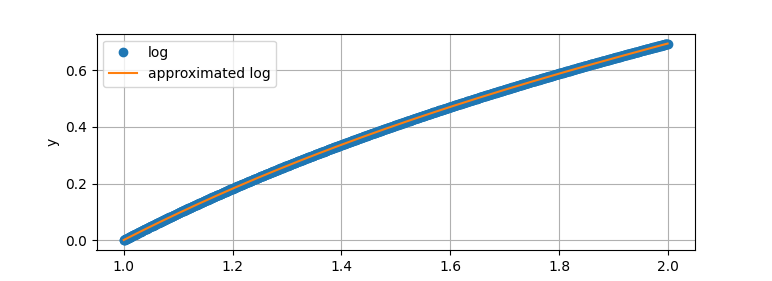
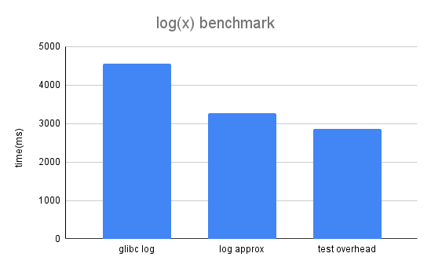

# Logarithmic Function Approximation

TLDR: faster $log(x)$ by using a 3-term instead of a 5-term polynomial, and
eliminating the call overhead.

This repository contains a fast approximation of the
[logarithmic](https://en.wikipedia.org/wiki/Logarithm) function. I became
interested in optimizing log because I found that it was one of the hottest
functions (most frequently executed) in a program that I was optimizing.


### Definition

Power is the multiplication of some base $n$ times: $x^n$. Exponent is
raising the mathematical constant $e$ to some power: $e^n$, and logarithm (log) is
the computation of the number $n$ for base $e$: $log_e(x)$. Log is valid for all
positive numbers, because the base $e$ is a positive number. Log is defined for
base $e$, but it is possible to compute logs for different bases. Example:
```
  >>> exp(2)
  7.38905609893065
  >>> log(exp(2))
  2.0

  >>> log(256)/log(2)
  8.0
```

### Problem

The libc implementation is accurate up to 1 [ULP](https://en.wikipedia.org/wiki/Unit_in_the_last_place).
In many cases this accuracy is not useful because applications don't need to be very accurate. The function needs to
be monotonic, because you want the ordering of $f(x)$, and $f(x+ε)$ to be consistent.

Another downside of using the libc implementation is that calling it requires
going through the ELF PLT/GOT indirection, which has [significant overhead](https://github.com/nadavrot/memset_benchmark)
for small functions.


### Fast Log Approximation

The fast implementation uses a 3-term polynomial to approximate the range $[1..2]$.  Most
of the values that I care about fall within a small range $[0.1 .. 2]$.  I decided
to fallback to using the libc's log for edge cases, such as
NaN, Infinity, Zero, etc. 

This image presents the approximation function in the range $[1..2]$.



So, how do we find the coefficients of the polynomial that approximates the log function? We want to
create a curve in the form $f(x) = ... C2 * X^2 +  C1 * X + C0$, to
approximate function in some *segment*, not the whole function.  I considered
using a Taylor series or SGD to fit the polynomial to the log curve. SGD would
be ideas, because you can back-propagate therough the simply polynomial
expression to adjust the coefficients. I discovered that scipy already
implemented an SGD-based fitting [technique](https://en.wikipedia.org/wiki/Levenberg%E2%80%93Marquardt_algorithm),
and you can find the solution in a few lines of python.

```
  import numpy as np
  from scipy.optimize import curve_fit
  from math import log

  # Generate the training data:
  x = np.arange(1, 2, 0.001)
  y = np.log(np.arange(1, 2, 0.001))

  # The polynomial to fit:
  def func1(x, a, b, c, d): return a * x**3 + b*x**2 + c*x + d

  params, _ = curve_fit(func1, x, y)
  a, b, c, d = params[0], params[1], params[2], params[3]
```

An alternative solution would be to generate minimax polynomial with Sollya. Minimax polynomials minimize maximum error and generate better results. This is a short Sollya script that reduces the error compared to the curve fitting method:

``` display = decimal; Q = fpminimax(log(x), 4, [|D...|], [0.9, 2]); Q; ```

The next step was to check the error. This is straight forward. Just subtract
the real function from the approximation function. As you can see the maximum
error is around 0.0008, for all values in the ranges $[1..2]$.


The polynomial approximation was accurate within the range $[1..2]$, but the
error increased rapidly outside of that range. You can fold numbers outside of
that range with a simple trick.
Consider the identity $\log_b(xy) = \log_b x +\log_b y$.  If y is constant then
we can turn this into $log(x/c1) - c2$.  I use a trick to collapse a larger
space $[0.007 .. 128]$ into the range $[1..2]$.

This is an example of adjusting the range of the log input, in base-2.
```
  >>> log(32, 2)
  5.0
  >>> log(16, 2) + 1
  5.0
  >>> log(8, 2) + 2
  5.0
  >>> log(4, 2) + 3
  5.0
  >>> log(2, 2) + 4
  5.0
```

or in code:

```
  // Bring down large values.
  while (x > 2) {
    x /= 2;
    shift -= 1;
  }

```


Other libc implementations use [5-term](https://github.com/rutgers-apl/The-RLIBM-Project/blob/main/libm/logf.c) to [7-term](https://github.com/Arquivotheca/SunOS-4.1.3/blob/2e8a93c3946e57cdcb7f39f2ab5ec270b3a51638/usr.lib/libm/C/log.c) 
polynomials for calculating log. Libc implementations use a lookup tables for collapsing the
larger space into the range that the polynomial can approximate accurately.
The [exponent](https://en.wikipedia.org/wiki/IEEE_754) bits of the float/double are used as an index to a
lookup table that does the transformation above.

### C++ implementation

The C++ implementation uses Horner's method for fast evaluation of small polynomials. Notice that we can rewrite our polynomial this way: $a x^4 + b x^3 + c x^2 + dx + e = e + x(d + x(c + x(b + ax))) $. Horner's representation requires fewer multiplications, and each pair of addition and multiplication can be converted by the compiler to a fused multiply-add instruction (fma).

The rest of the code should be straightforward, and is available in this repo. 

Make sure to compile the code with:

```
  clang++ bench.cc -mavx2 -mfma -O3 -fno-builtin ; ./a.out
```

Benchmark results:
```
  name = fast_log, sum = 3.77435e+08, time = 3092ms
  name = stdlib, sum = 3.77416e+08, time = 4685ms
  name = nop, sum = 10000, time = 2905ms
  Tested 11000 values [0..20]
  Max error 0.00098444 at 16.002
  # 2.77271 vs 2.7737
  Tested 10000 values [0..20]
  Found 0 non-monotinic values
```



