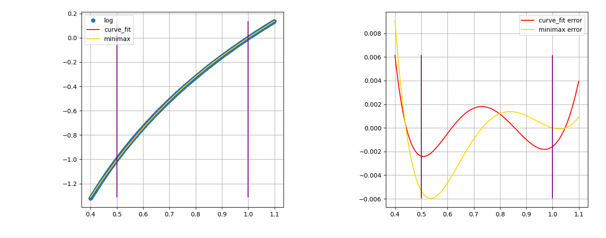

# Logarithmic and Exponential Function Approximation

This repository contains a fast and *readable* approximation of the
logarithmic and exponential functions. It should be easy to follow the C++ and
Python code in the 'exp' and 'log' subdirectories.

I was always curious about the implementation of these functions and I finally
found an excuse to learn how they work when I found that log was one of the
hottest functions in a program that I was trying to optimize. I decided to write
a fast approximation function and share my findings here.

### Definition

Power is the multiplication of some base $n$ times: $x^n$. Exponent is
raising the constant $e$ to some power: $e^n$, and logarithm (log) is
the computation of the number $n$ for base $e$: $log_e(x)$. Log is valid for all
positive numbers, because the base $e$ is a positive number. Log is defined for
base $e$, but it is possible to compute logs for different bases. Example:
```
  >>> exp(2)
  7.38905609893065
  >>> log(exp(2))
  2.0

  >>> log(256)/log(2)
  8.0
```

### Problem

The libc implementation is accurate up to 1
[ULP](https://en.wikipedia.org/wiki/Unit_in_the_last_place).  In many cases this
accuracy is not useful because many programs don't need this level of accuracy.
We are going to implement faster implementations that are going to be less
accurate.  Accuracy is not the only requirement. Some mathematical functions
need to be monotonic, because you want the ordering of $f(x)$, and $f(x+ε)$ to
be consistent.

### How?

There are several tricks that we can use to approximate logarithmic and
exponential function: fitting a polynomial, reducing the range, using lookup
tables, and recursive reduced-precision helper functions and a few other.  Let's
use these tools to approximate $log$ and $exp$.

The first step is to figure out how to approximate a region in the target
function. To do that we'll use a polynomial.

We need to find coefficients that construct the polynomial that approximates
$exp$ or $log$ function. We want to create a curve in the form
$f(x) = ... C2 * X^2 +  C1 * X + C0$, to approximate a *segment*.
Polynomials are not shaped like $log$ or $exp$, so we can only hope to fit a segment.

There are two tools that we could use. The first tool is a part of Scipy.
Scipy has an SGD-based fitting [technique](https://en.wikipedia.org/wiki/Levenberg%E2%80%93Marquardt_algorithm),
that can fit a polynomial in a few lines of python.

This is how we fit a polynomial with scipy:
```
  import numpy as np
  from scipy.optimize import curve_fit
  from math import log

  # Generate the training data:
  x = np.arange(1, 2, 0.001)
  y = np.log(np.arange(1, 2, 0.001))

  # The polynomial to fit:
  def func1(x, a, b, c, d): return a * x**3 + b*x**2 + c*x + d

  params, _ = curve_fit(func1, x, y)
  a, b, c, d = params[0], params[1], params[2], params[3]
```

The second solution is to use minimax polynomials with Sollya. Sollya is a
floating-point development toolkit that library designers use.  Minimax
polynomials minimize maximum error and in theory should generate excellent
results. This is a short Sollya script to find the polynomial coefficients:

``` display = decimal; Q = fpminimax(log(x), 4, [|D...|], [0.5, 1]); Q; ```



We've constructed a polynomial that approximates a function segment. Let's
evaluate how well it works. This is straight forward. Just subtract the real
function from the approximation function. As you can see the maximum error for
$log$ is around 0.002, for all values in the ranges $[0.5 .. 1]$.


### Range reduction

The polynomial approximation is accurate within a segment, but the error
increases rapidly outside the target range.  The next step is to figure out how to
evaluate the entire range of the function. We use different tricks for each of
the functions.

#### Exp

One of the identifies of the exponential function is $e^{a+b} = e^a * e^b$.
This allows us to split the input $x$ into two parts: an integral part, and a
fraction. For example, we would split the number 3.1415 into 3 and 0.1415. We can check that
$e^{3.1415} = e^3 * e^{0.1415}$.

This makes things easier for us because we can evaluate the fraction using our
polynomial, and we can evaluate the integral part using a small lookup table.
The highest number that we can compute without overflowing double-precision floats
is 710, so this is the size of our lookup table.

One way to handle negative numbers is to rely on the identity $e^{-x} = 1/{e^x}$,
but branch mispredictions make this inefficient. So, instead we'll just extend the
lookup table to the range $[-710, 710]$.

And that's it. This is our implementation:

```
  double expExp(double x) {
    double integer = trunc(x);
    // X is now the fractional part of the number.
    x = x - integer;

    // Use a 4-part polynomial to approximate exp(x);
    double c[] = {0.28033708, 0.425302, 1.01273643, 1.00020947};

    // Use Horner's method to evaluate the polynomial.
    double val = c[3] + x * (c[2] + x * (c[1] + x * (c[0])));
    return val * EXP_TABLE[(unsigned)integer + table_zero_idx];
  }
```


#### Log

Just like $exp$, we need to find a trick to collapse the range of the function.
Log is only valid for positive integers, so we don't have to worry about the
negatives. Consider the identity $\log_b(xy) = \log_b x +\log_b y$.  If y is
constant then we can turn this into $log(x/c1) - c2$. Let's use this trick to collapse
a larger space into the approximated segment.

This is an example of adjusting the range of the log input, in base-2.
```
  >>> log(32, 2)
  5.0
  >>> log(16, 2) + 1
  5.0
  >>> log(8, 2) + 2
  5.0
  >>> log(4, 2) + 3
  5.0
  >>> log(2, 2) + 4
  5.0
```

We could write this code:

```
  // Bring down large values.
  while (x > 2) {
    x /= 2;
    shift -= 1;
  }

```
However, there is a better way. Again, we will split the input into integral
and fraction components, but this time we are going to rely on the underlying
representation of the floating point number, that already stores the number as a
multiplication of a power-of-two.
The [exponent](https://en.wikipedia.org/wiki/IEEE_754) bits of the float/double are what we need to figure out the log bias.

The function $frexp$ does that except that it's too slow because it requires
going through the ELF PLT/GOT indirection, which has [significant overhead](https://github.com/nadavrot/memset_benchmark) for small functions. But
luckily we can implement it in a few lines of code.

And that's it. This is the code:

```
  double fastLog(double x) {
    /// Extract the fraction, and the power-of-two exponent.
    auto a = my_frexp(x);
    x = a.first;
    int pow2 = a.second;

    // Use a 4-part polynom to approximate log2(x);
    double c[] = {1.33755322, -4.42852392, 6.30371424, -3.21430967};
    double log2 = 0.6931471805599453;

    // Use Horner's method to evaluate the polynomial.
    double val = c[3] + x * (c[2] + x * (c[1] + x * (c[0])));

    // Compute log2(x), and convert the result to base-e.
    return log2 * (pow2 + val);
  }

```

### Faster Approximation

Libc implementations usually use [5-term](https://github.com/rutgers-apl/The-RLIBM-Project/blob/main/libm/logf.c) to [7-term](https://github.com/Arquivotheca/SunOS-4.1.3/blob/2e8a93c3946e57cdcb7f39f2ab5ec270b3a51638/usr.lib/libm/C/log.c) 
polynomials for calculating $log$ and $exp$. It is possible to use few coefficients to get faster and less accurate implementations.

The C++ implementation uses Horner's method for fast evaluation of small polynomials. Notice that we can rewrite our polynomial this way: $a x^4 + b x^3 + c x^2 + dx + e = e + x(d + x(c + x(b + ax))) $.

Horner's representation requires fewer multiplications, and each pair of addition and multiplication can be converted by the compiler to a fused multiply-add instruction (fma).

Make sure to compile the code with:
```

  clang++ bench.cc -mavx2 -mfma -O3 -fno-builtin ; ./a.out
```

Benchmark results:

```
EXP:
name = nop,      sum =            , time = 163ms
name = fast_exp, sum = 1.10837e+11, time = 166ms
name = libm_exp, sum = 1.10829e+11, time = 383ms

LOG:
name = nop     , sum =            , time = 165ms
name = fast_log, sum = 1.46016e+08, time = 167ms
name = libm_log, sum = 1.46044e+08, time = 418ms

```

